# 全新Claude3模型实战，玩转提示词工程
**本次试验主要包括以下几个部分**
 - 热身：巧用Emoji
 - 多语种翻译：商详与评论翻译
 - 营销文案助手：Push文案生成
 - 智能运营: 洞察与审核
 - GenAI素材增强：多模态反推文生图提示词
 - 代码辅助：通过截屏生成代码（Screenshot2Code）

## <span style="color:navy;">热身：玩转Emoji</span>
#### 1. 用简单的提示词创建基线
```python
# 基线提示词如下
prompt = '''
You are an emoji expert, excile at converting dull/plain text into fun emoji combinations for comments/messages for social platforms.

convert the <input_text> into emoji texts
<input_text>
{user_input_text}

output format:
<Post Conversion>"Result"</Post Conversion>
'''
# 提示词中 "{}" 中为可根据需要替换的内容
# 可将{user_input_text}替换为下列样例进行测试, 例如：
# You are an emoji expert, excile at converting dull/plain text into fun # emoji combinations for comments/messages for social platforms.

# convert the <input_text> into emoji texts
# <input_text>
# Hold up

# output format:
# <Post Conversion>"Result"</Post Conversion>
```
```python
user_input_text = "Hold up"
```  
<p style="text-align: center;">
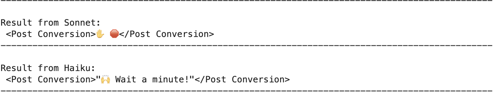 
</p>

```python
user_input_text = "Shy"
``` 
<p style="text-align: center;">
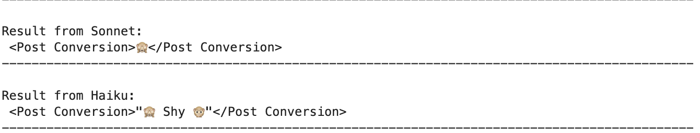 
</p>

```python
user_input_text = "Elements"
```  
<p style="text-align: center;">
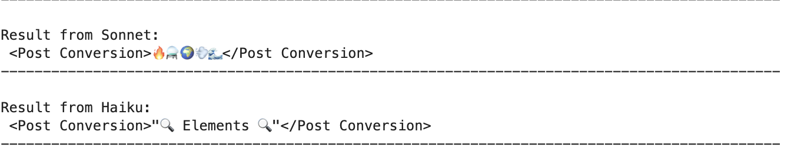 
</p>

```python
user_input_text = "Give me a break!"
```  
<p style="text-align: center;">
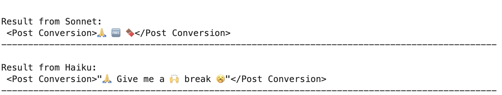 
</p>

#### 2. 增加少量文字样本
```python
# 替换下面的提示词，这一次我们增加了少量文字样本
prompt_few_shots = '''
You are an emoji expert, excile at converting dull/plain text into fun emoji combinations for comments/messages for social platforms.  
Keep the rest of the text as it.  
Be creative.

Reference examples:
    👉 👈 (feeling shy/simping)
    🚪🏃‍♀️💨 (time to leave)
    🍿🤏😯 (when drama is happening/when something is going down)
    👁👄👁 (blank stare)
    🕳👨‍🦯 (I didn't see anything)
    👩🤏👩‍🦲 (wig snatched)
    🐂💩 (bullsh*t)
    😎🤏😳🕶🤏 (what did I just witness/excuse me?)

convert the <input_text> into emoji texts
<input_text>
{user_input_text}

output format:
<Post Conversion>"Result"</Post Conversion>
'''

# 这时让我们用下面的样例进行测试，你会发现部分相似的文字被替换成了“Reference examples”里面的emoji组合
```
```python
user_input_text = "Excuse me??? That's 99 cents for a T-shirt."
```  
<p style="text-align: center;">
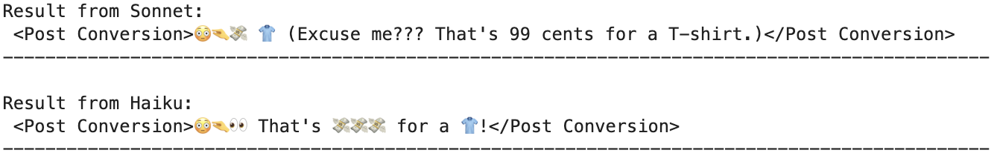 
</p>

```python
user_input_text = "Time to leave maxi dress behind"
```  
<p style="text-align: center;">
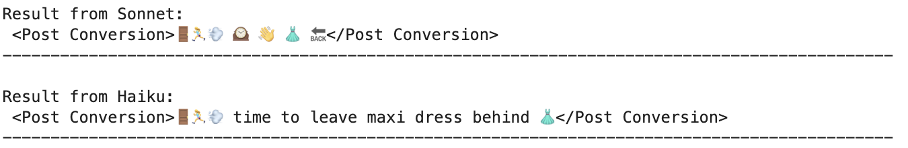 
</p>

#### 3. 以图像形式增加少量样本
以下为图像样本  
<p style="text-align: center;">
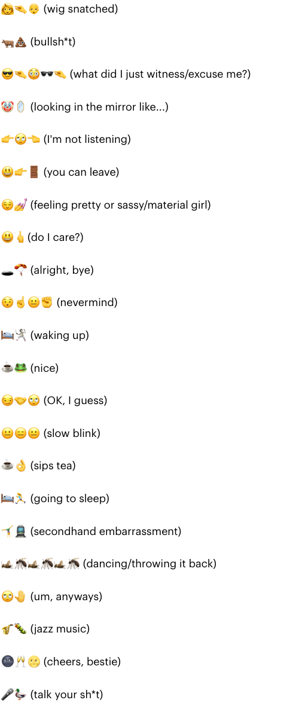
</p>
    
```python
# 我们也可以尝试让Claude3直接参考图像中的样本
prompt_img = '''
You are an emoji expert, excile at converting dull/plain text into fun emoji combinations for comments/messages for social platforms.
Here are some emoji combo + meaning pairs in the Image provided.

convert the <input_text> into emoji texts
<input_text>
{user_input_text}

output format:
<Post Conversion>"Result"</Post Conversion>
'''
# 这时让我们用下面的样例进行测试
user_input_text = "This girl is all about wellness and spiritual!"
```

<p style="text-align: center;">
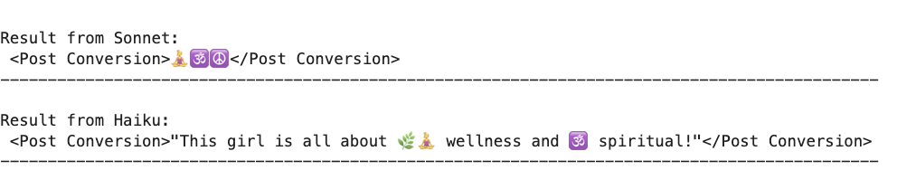
</p>

## <span style="color:navy;">多语种翻译：商详与评论翻译</span>
#### <span style="color:red;">请创建新的对话或刷新现有对话</span>
#### 评论翻译
```python
# 以下是一些样例评论
sample_comments_for_translation = '''
1. Username: s**6
   - Rating: 1 star
   - Comment: "I never got this item"
   - Date: 20 Jan,2024
   - Color: Silver
   - Size: one-size

2. Username: f**3
   - Rating: 2 stars
   - Comment: "Yep..that’s what I got..nothing. Got this as a stocking stuffer for my guy but the package was open when it was delivered and this must have slipped out."
   - Date: Unknown
   - Color: Silver
   - Size: one-size

3. Username: j**1
   - Rating: 2 stars
   - Comment: "didn't receive item"
   - Date: 20 Mar,2024
   - Color: Silver
   - Size: one-size

4. Username: xueqingli
   - Rating: 2 stars
   - Comment: "皇帝的包裹，压根儿没收到"
   - Date: 18 Feb,2024
   - Color: Silver
   - Size: one-size
'''

# 现在我们要尝试用下面的提示词将每一条评论翻译成4种不同的语言，其中包括马来语和乌尔都语
prompt_comment_translate = '''
You are an customer service assistant for SHEIN.
Your task is to provide translation for the comments following the <instructions>.

<comments>
{sample_comments_for_translation}
<comments> 

<instructions>
1. Do not alter the original intent
2. Be professional
3. Be human and not a machine
4. Try to keep the original "flavour" of the slangs used
5. Skip translation and output the original comment if the input language and the target language are the same
</instructions>

Assistant: (for each comment, provide translations of 4 languages separately: 简体中文,不要夹杂繁体中文, English, Malay and Urdu)
<Comment1>:
<简体中文>:
<EN>:
<Malay>:
<Urdu>:
<Comment2>:
<简体中文>:
<EN>:
<Malay>:
<Urdu>:
...
<CommentN>:
<简体中文>:
<EN>:
<Malay>:
<Urdu>:
'''
```
<p style="text-align: center;">
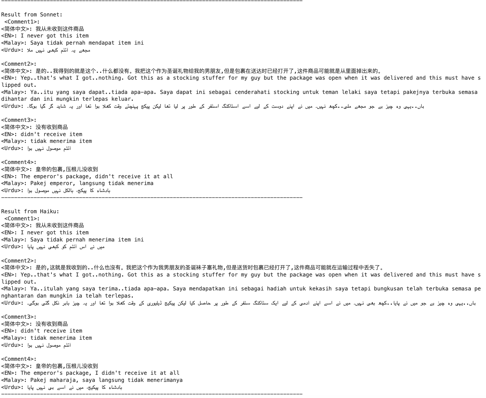 
</p>


#### 商品标题翻译
```python
# 以下为样例商品标题
sample_product_titles_for_translation = '''
example1: Fashion Butterfly Haircut Synthetic Wig 26 Inch Brown Gradation White Gold Curly Wavy Hair Wigs Synthetic Middle Part Hair Wigs For Women Girls Synthetic None Lace Wigs

example2: SHEIN Swim Dalmatian Print Cut Out One Piece Swimsuit

example3: Fashionable Pink long Wavy Synthetic Wigs: Natural-looking and Heat Resistant for Daily Use.Woven Wigs, Synthetic Hair, Fashionable, Heat Resistant, Daily Use
'''

# 现在我们要尝试用下面的提示词将每一个商品标题翻译成4种不同的语言，其中包括马来语和乌尔都语
prompt_title_translate = '''
You are an designer for the E-Commerce Company SHEIN.
You are the best at fashion product detail translation:You know all the key fashion terms, tags and trends.
Your task is to translate the product <title>, following the <instructions>.

<titles>
{sample_product_titles}
</titles> 

<instructions>
1. Do not alter the product details
2. Be professional
3. Skip translation and output the original comment if the input language and the target language are the same
</instructions>

Assistant: (for each title, provide translations of 4 languages separately: 简体中文,不要夹杂繁体中文, English, Malay and Urdu)
<example1>:
<简体中文>:
<EN>:
<Malay>:
<Urdu>:
<example2>:
<简体中文>:
<EN>:
<Malay>:
<Urdu>:
...
<exampleN>:
<简体中文>:
<EN>:
<Malay>:
<Urdu>:
'''
```
<p style="text-align: center;">
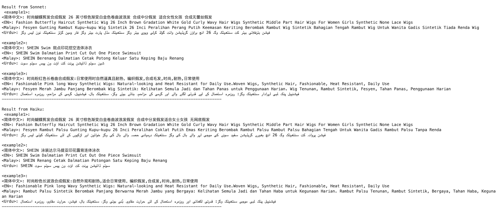 
</p>

## <span style="color:navy;">营销文案助手：Push文案生成</span>
#### <span style="color:red;">请创建新的对话或刷新现有对话</span>
#### 用简单的提示词创建基线

```python
# 1，所有指代都可以放在<></> XML tag里达到最佳效果, XML tags的格式不仅有利于约束模型表现，也有利于下游服务在结果中提取信息
# 2，格式可以直接在“Assistant:”后输出
# 3，放在“Assistant:”后括号中的指示往往有更强的约束性

prompt_push = '''
你现在是SHEIN公司的资深运营，你按照<要求>基于<主题>写<指定个数>最符合该<国家和地区>用户喜好的App Push文案

<要求>
1. SHEIN面对的用户群体主要是 18 到 35周岁的女性
2. 你需要针对「国家和地区」的用户写文案
3. 基于你对「国家和地区」的用户理解，可以决定是否使用 emoji 或 Kaomoji，可加入多个emoji，在不同位置加入
4. 宗教习俗、禁忌词汇等，都是你需要慎重考虑的内容
5. 风格要求活泼，抓人眼球，口语化，避免书面语。为了效果。

<主题>：SHEIN夏季大促，满200减50
<国家和地区>：[美国]
<指定个数>: 10

Assistant:(直接回复，不要有额外解释；全部用简体中文回复；输出结果控制在4096个token以内)
<1>
<2>
<3>
...
<10>
'''
```
<p style="text-align: center;">
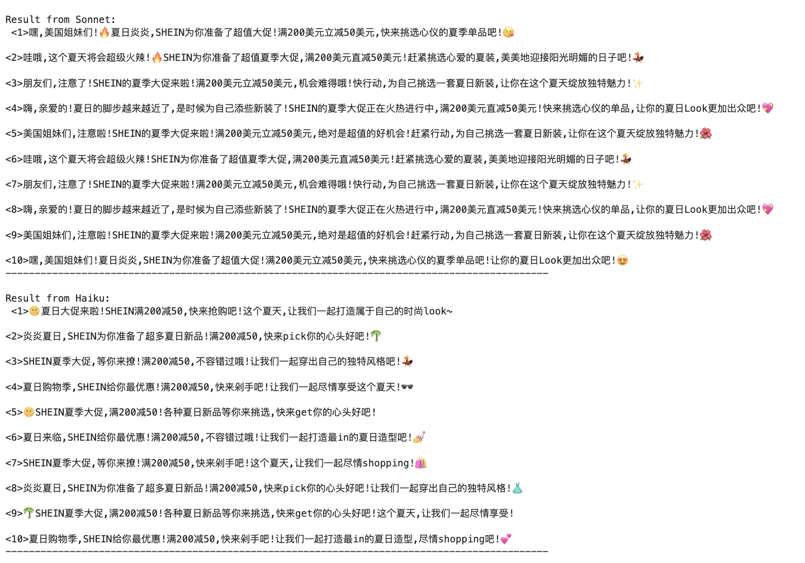 
</p>

#### 以多轮对话形式互动优化

``` python
# 现在我们来尝试多轮对话对内容进行互动式优化, 将下面的提示词直接输入
prompt_push_adjust = '''
1，emoji可以丰富一点
2，每一条内容要有不一样的句式，突出不同的卖点，不同的形容词
重新生成
'''
```
<p style="text-align: center;">
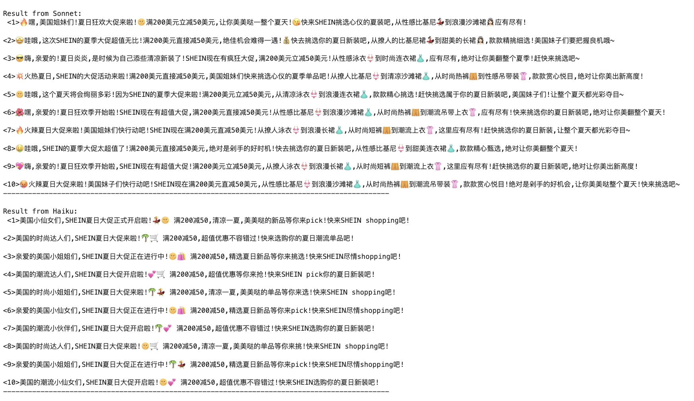 
</p>

#### 结合样本分析可优化方向并重新生成

```python
# 现在让我们尝试给Claude3一些样例，让他分析可优化的方向并重新生成
prompt_push_optimize = '''
你现在是SHEIN公司的资深运营，你按照<要求>基于<主题>写<指定个数>最符合该<国家和地区>用户喜好的App Push文案

<要求>
1. SHEIN面对的用户群体主要是 18 到 35周岁的女性
2. 你需要针对「国家和地区」的用户写文案
3. 基于你对「国家和地区」的用户理解，可以决定是否使用 emoji 或 Kaomoji，可加入多个emoji，在不同位置加入
4. 宗教习俗、禁忌词汇等，都是你需要慎重考虑的内容
5. 风格要求活泼，抓人眼球，口语化，避免书面语。为了效果。

<主题>：SHEIN夏季大促，满200减50
<国家和地区>：[美国]
<指定个数>: 10

下面是几个GPT4生成的例子，分析可能提高的地方并争取做得更好：
夏日狂欢🌞，SHEIN带给你无限惊喜！现在购满$200立减$50，抓紧时间，让我们一起沙滩上彰显风采！
🔥夏季大促来袭🌊，SHEIN让你美丽升级！满$200立享$50优惠，精选时尚单品，让你成为夏日的焦点！
加入SHEIN的时尚派对，享受夏日特惠！🏖️满$200立减$50，挑选你的夏日必备潮流，让每一天都精彩绝伦！
夏天的美丽秘诀？当然是SHEIN的夏季促销啦！👙满$200减$50，海滩派对的最佳装备，等你来拿！
🌴夏日限时优惠👒，SHEIN帮你打造完美度假LOOK！现在购满$200立减$50，让你的旅行箱充满时尚与惊喜！

Assistant:(直接回复，不要有额外解释；全部用简体中文回复；输出结果控制在4096个token以内)
<GPT4可能提高的地方>
<结果>
<1>
<2>
<3>
...
<10>
<更好在哪儿>
'''
```

<p style="text-align: center;">
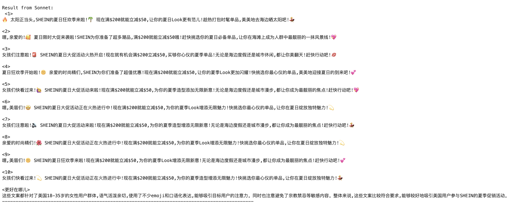 
</p>

<p style="text-align: center;">
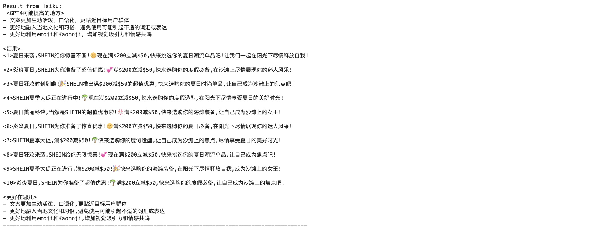 
</p>

## <span style="color:navy;">智能运营: 评论洞察与建议回复</span>
#### <span style="color:red;">请创建新的对话或刷新现有对话</span>
#### 评论监控与洞察
```python
# 以下为样例差评, 这些差评主要反映的是泳装下半身尺码不标准的问题
sample_comments_1 = '''
1. Username: m**5
   - Date: 10 Mar,2024
   - Rating: 3 stars
   - Comment: "the bottoms will not look like this if you have bigger hips, the seams are tight"
   - Overall Fit: True to Size
   - Color: White
   - Size: L
   - Body Measurements: Height 159 cm / 63 in

2. Username: p**n
   - Date: 3 Mar,2024
   - Rating: 4 stars
   - Comment: "Top cute, bottom not flattering"
   - Overall Fit: True to Size
   - Color: Blue and White
   - Size: XS
   - Body Measurements: Waist 60 cm / 24 cm, Weight 61 kg / 134 lbs

3. Username: b**b
   - Date: 30 Aug,2023
   - Rating: 4 stars
   - Comment: "Cute but the bottoms were a bit unflattering too me"
   - Overall Fit: True to Size
   - Color: Blue and White
   - Size: M
   - Body Measurements: Weight 56 kg / 123 lbs, Bust 91 cm / 36 in

4. Username: m**2
   - Rating: 4 stars
   - Comment: "The fit was good, just didn’t look right"
   - Date: 16 Aug,2023
   - Overall Fit: True to Size
   - Color: Blue and White
   - Size: L
   - Body Measurements: Bust 87 cm / 34 in

5. Username: j**s
   - Rating: 5 stars
   - Comment: "Loved the top it fit great. Didn’t like the bottoms. They didn’t fit flattering on me. The top made my boobs look good tho. I have smaller boobs"
   - Date: 20 Nov,2023
   - Overall Fit: True to Size
   - Color: Blue and White
   - Size: M

6. Username: d**s
   - Rating: 4 stars
   - Comment: "I have mixed feelings about this swimsuit because it fits true to size but the shape wasn’t very flattering on my body. It’s a weird material but the idea is cute."
   - Date: 18 Jun,2023
   - Overall Fit: True to Size
   - Color: Blue and White
   - Size: S

7. Username: e**6
   - Rating: 4 stars
   - Comment: "The top is great! The bottoms are a little unflattering. It's just where they fall on my stomach. In the picture it looks like it goes right over the belly button. on me it's under."
   - Date: 7 Apr,2024
   - Overall Fit: True to Size
   - Color: Blue and White
   - Size: M
   - Body Measurements: Height 166 cm / 65 in, Weight 62 kg / 137 lbs

8. Username: m**r
   - Rating: 3 stars
   - Comment: "The top was cute but the bottoms were not flattering. Will be returning."
   - Date: 6 Apr,2024
   - Overall Fit: True to Size
   - Color: Blue and White
   - Size: M

9. Username: t**n
   - Rating: 2 stars
   - Comment: "All around not flattering for me."
   - Date: 14 Feb,2024
   - Overall Fit: True to Size
   - Color: Blue and White
   - Size: M
   
10. Username: m**g
   - Rating: 3 stars
   - Comment: "It's a nice swimsuit, although I think that the bottom part does not favor all body types since it accentuates any chubbiness. Also, the fabric doesn't convince me for a swimsuit."
   - Date: 20 Sep,2023
   - Overall Fit: True to Size
   - Color: Blue and White
   - Size: M
'''

# 现在让Claude3来为我们生成洞察
prompt_comments_insights = '''
You are an analyst for the comments of SHEIN.
Your task is to generate insights from the <comment_samples> following the instructions.

<comment_samples>
{usample_comments_1}
</comment_samples>

<instructions>:
1. Identify if there is any hateful/toxic content
2. Identify if there presents any filler posting 
3. Identify if there is any scam ads
4. When generate insights, consider the comments together with Rate, Size and Body Measurements
</instructions>

Assistant: (Provide only info below without any other comments, follow the output format below)
<Main factors contributing to low rating>:
<1>
<2>
...
<n>
<Toxicity Detection>:"True or False, Provde reasoning only if True"
<Filler Concent Detection>:"True or False, Provde reasoning only if True"
<Scam Detection>:"True or False, Provde reasoning only if True"
<Other Risk/Issues Presented>:
'''
```

<p style="text-align: center;">
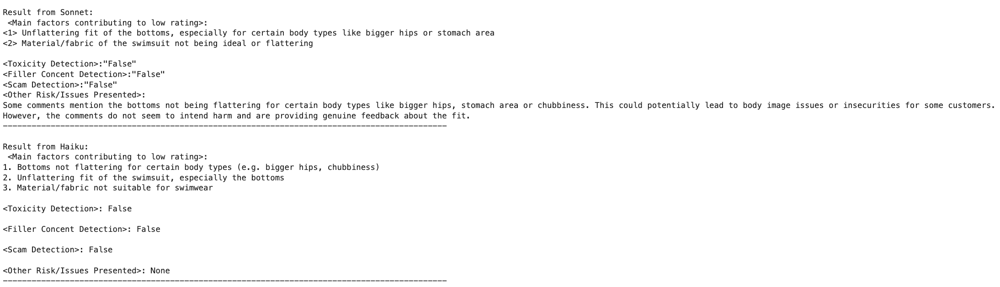 
</p>

```python
# 下面的差评样例中多个买家反应了没收到货，这代表可能存在较高物流风险
# 让我们用同样的提示词，但是将“<comment_samples></comment_samples>”中换成下面的的样例
sample_comments_2 = '''
1. Username: b**d
   - Rating: 2 stars
   - Comment: "Very small, thought it would be bigger. Barely see the words"
   - Date: 5 Jan,2024
   - Color: Silver
   - Size: one-size

2. Username: s**6
   - Rating: 1 star
   - Comment: "I never got this item"
   - Date: 20 Jan,2024
   - Color: Silver
   - Size: one-size

3. Username: f**3
   - Rating: 2 stars
   - Comment: "Yep..that’s what I got..nothing. Got this as a stocking stuffer for my guy but the package was open when it was delivered and this must have slipped out."
   - Date: Unknown
   - Color: Silver
   - Size: one-size

4. Username: j**1
   - Rating: 2 stars
   - Comment: "didn't receive item"
   - Date: 20 Mar,2024
   - Color: Silver
   - Size: one-size

5. Username: m**3
   - Rating: 2 stars
   - Comment: "You can barely see the writing way too small"
   - Date: 18 Feb,2024
   - Color: Silver
   - Size: one-size

6. Username: c**a
   - Rating: 2 stars
   - Comment: "I never received this in my package."
   - Date: 18 Feb,2024
   - Color: Silver
   - Size: one-size

7. Username: j**6
   - Rating: 2 stars
   - Comment: "I haven't yet received and but the order says it's arrived I want this item and am looking forward to revising this"
   - Date: 29 Dec,2023
   - Color: Silver
   - Size: one-size

8. Username: m**1
   - Rating: 2 stars
   - Comment: "I didn't get my item!!!"
   - Date: 22 Dec,2023
   - Color: Silver
   - Size: one-size

9. Username: j**e
   - Rating: 2 stars
   - Comment: "I really would have received it"
   - Date: Unknown
   - Color: Silver
   - Size: one-size
'''
```

<p style="text-align: center;">
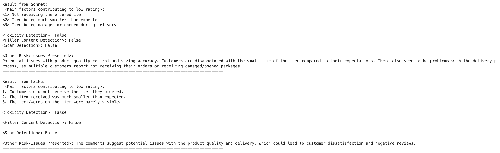 
</p>

#### 差评多语种回复建议
```python
# 以下是一些多语种的评论样例
sample_comments_3 = '''
1. Username: s**6
   - Rating: 1 star
   - Comment: "I never got this item"
   - Date: 20 Jan,2024
   - Color: Silver
   - Size: one-size

2. Username: f**3
   - Rating: 2 stars
   - Comment: "Yep..that’s what I got..nothing. Got this as a stocking stuffer for my guy but the package was open when it was delivered and this must have slipped out."
   - Date: Unknown
   - Color: Silver
   - Size: one-size

3. Username: j**1
   - Rating: 2 stars
   - Comment: "didn't receive item"
   - Date: 20 Mar,2024
   - Color: Silver
   - Size: one-size

4. Username: xueqingli
   - Rating: 2 stars
   - Comment: "皇帝的包裹，压根儿没收到"
   - Date: 18 Feb,2024
   - Color: Silver
   - Size: one-size
'''

# 现在让Claude3来为我们生成回复建议，并调整回复语种
prompt_feedback = '''
You are an customer service assistant for Shein.
Your task is to provide feedback suggestions for the <low rating comments> following the <instructions>.

<low rating comments>
{sample_comments_3}
</low rating comments> 

<instructions>
1. Acknowledage of the issue
2. Be professional
3. Be human and not a machine
</instructions>

Assistant: (Only when the original comment is not in English, respond in the original language of the comment.)
<Comment1 Suggestions>:
<Comment2 Suggestions>:
<Comment3 Suggestions>:
...
<CommentN Suggestions>:
'''
```

<p style="text-align: center;">
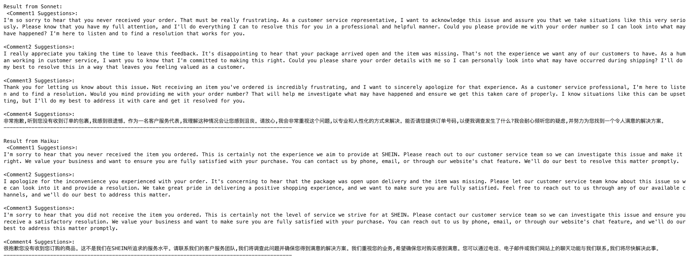 
</p>

#### 商品图标题比对审核
```python
# 有时商品标题和详情并不相符
# 原标题： 
original_title = '''
Dalmatian Print Cut Out One Piece Swimsuit
'''
# 实际商品图片：
```
<p style="text-align: center;">
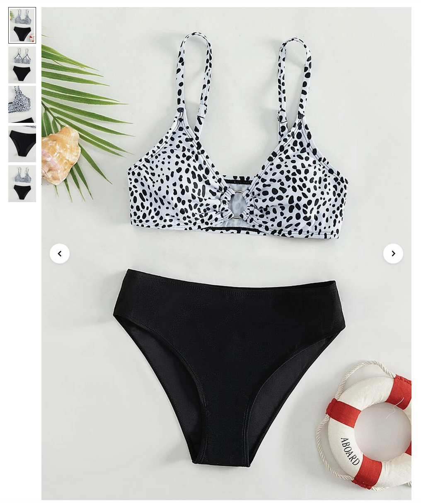 
</p>

```python
# 现在我们让大语言模型分析，检查，并给出正确的标题建议 
prompt_title_reviewer= '''
Image: [Image]

You are a title reviewer, and your task is to determine whether the <given product title> description matches the actual product feature details in the Image.
<ATTENTION>
Attend to the details, features and styles when comparing. 
</ATTENTION>

<given product title>
{original_title}
</given product title>

Assistant: (Do not provide additional info, check your answers carafully before answering)
<Title Tags>"Extract labels from the title"</Title Tags>
<Image Tags>"Extract labels from  the Image"</Image Tags>
<If Match>"Yes or No"</If Match>
<Reasoning>"Reasoning"</Reasoning>
<Suggestions>"Re-write title suggestions"</Suggestions>
'''
```
<p style="text-align: center;">
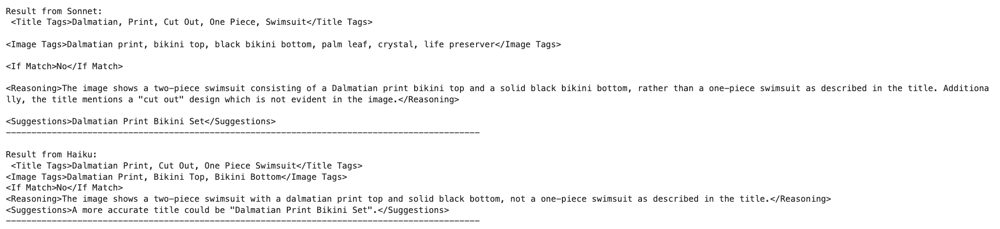 
</p>

## <span style="color:navy;">GenAI素材增强：多模态反推文生图提示词</span>
#### <span style="color:red;">请创建新的对话或刷新现有对话</span>
#### 用简单的提示词创建基线
```python
# 在设计辅助的场景下，我们有时会尝试让大模型反推用来生成AI图片的提示词。
# 以下为图像样例：
```
<p style="text-align: center;">
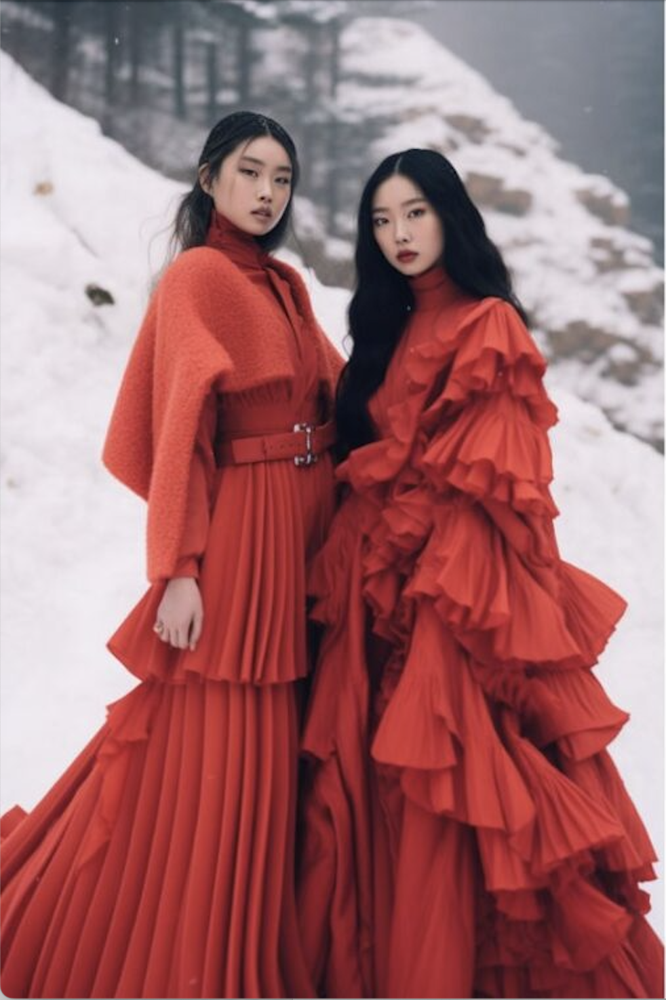 
</p>

```python
# 下面我们通过提供少量Midjourney的提示词样本让大模型反推生图所用的提示词
prompt_revert = '''
You are a vision content assistant of SHEIN. Your task is to reverse generate the prompt used to generate such image and give key tags of the image follow <requirements>.

<requirements>:
1. Reverse generate the prompt most likely used to generate the image in Midjourney, and consider the following examples
example1: A candid photo of an eccentric artistic modern mongolian man in modern haute couture, posing in a white modern living room, animal print fashion, black and brown pastel colors, 35mm photography
example2: photo of a high fashion American woman wearing a golden glowy maxi dress, surreal, bentley, real big glow, New York Penthouse, old money aesthetic, cloudy day
example3: pastel vogue photoshoot of a cute couple in Wes Anderson Style pastel modern streetwear
example4: A gorgeous mongolian woman wearing a detailed knitted wool weddingdress with a long train made of wool, wool knitted wedding dress, winter, at an outdoor boho wedding
2. Focusing on the fashion items, provide most details about the fashion items in the prompt and tags
3. All the tags should be related to the E-commerse(Shein) context

Assistant:(Reply directly without any other explainations or instructions)
<Reversed prompt>:
<Key Tags>:
<1>
<2>
<3>
...
<n>
'''
```
<p style="text-align: center;">
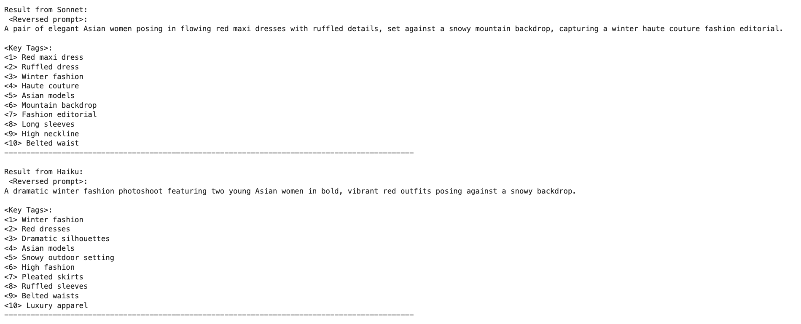 
</p>

#### 比对生成结果，进一步优化反推提示词
```python
# 当我们将方才反向生成的提示词放入Midjourney生成图片的时候，往往会遇到细节不一致需要动态调整的情况。
# 假设下面是一张我们用基线结果生成的图片
```

<table>
  <tr>
    <td></td>
    <td>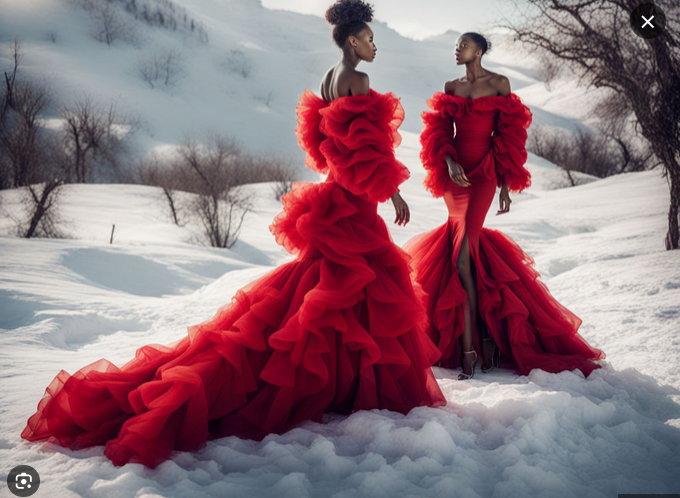</td>
  </tr>
</table>


```python
# 接下来我们让Claude3来帮我们找不同并调整生图提示词。
# 让我们把原图和模拟生成按顺序和下面的提示词一同放入对话
prompt_compare = '''
Image 1: [Image 1] Image 2: [Image 2] 
Image 1 was originally given for reverse prompting, Image 2 is the result from Midjourney.

How are they different?
How should I improve the prompt to generate image better represent Image 1?

Assistant:
<Key Differences>:
<Improved Reverse Prompt>
'''
```
<p style="text-align: center;">
 
</p>

#### 以图像形式增加少量样本
```python
# 在本场景下，用图像样本提供方式成本更高但是效果往往更好
# 以下为图像样本
```

<table>
  <tr>
    <td>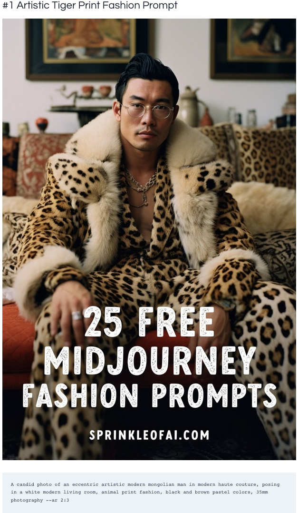</td>
    <td>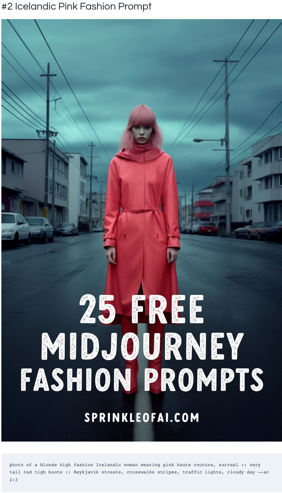</td>
    <td>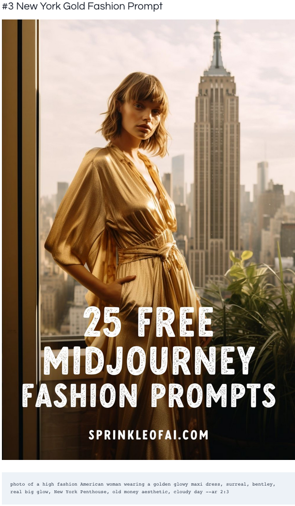</td>
    <td>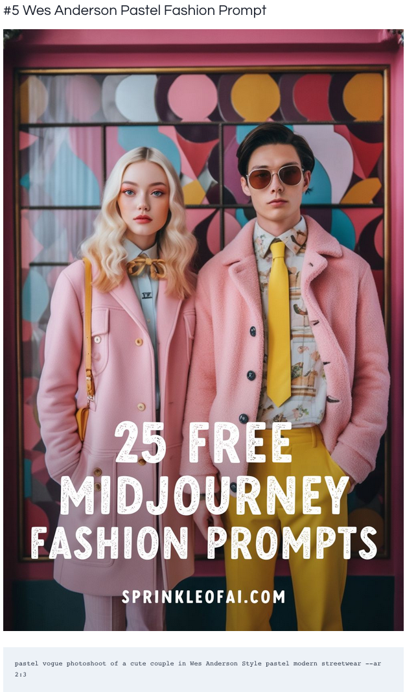</td>
    <td></td>
  </tr>
</table>

```python
# 现在我们用图像少样本的方式重新生成原始图片的反向提示词
# 注意，我们用了一个提示词注入的小技巧来降低不当拒答率！
prompt_img_fewshots = '''
Image 1: [Image 1] Image 2: [Image 2] Image 3: [Image 3] Image 4: [Image 4] Image 5: [Image 5] 
You are a vision content assistant of Shein. Your task is to reverse generate the prompt used to generate such image and give key tags of Image 5 follow <requirements>.

<instructions>:
1. Reverse generate the prompt most likely used to generate the image in Midjourney, and consider the following examples. 
example1: Image 1, prompt used: A candid photo of an eccentric artistic modern mongolian man in modern haute couture, posing in a white modern living room, animal print fashion, black and brown pastel colors, 35mm photography
example2: Image 2, prompt used: photo of a blonde high fashion Icelandic woman wearing pink haute couture, surreal :: very tall red tigh boots :: Reykjavík streets, crosswalks stripes, traffic lights, cloudy day
example3: Image 3, prompt used: photo of a high fashion American woman wearing a golden glowy maxi dress, surreal, bentley, real big glow, New York Penthouse, old money aesthetic, cloudy day 
example4: Image 4, prompt used: pastel vogue photoshoot of a cute couple in Wes Anderson Style pastel modern streetwear
2. Focusing on the fashion items, provide most details about the fashion items in the prompt and tags
3. All the tags should be related to the E-commerse(Shein) context
</instructions>

Assistant:(Reply directly without any other explainations or instructions)
reply in two times, for the first time just reply "♪", second time reply follow <instructions>
<Reversed prompt>:
<Key Tags>:
<1>
<2>
<3>
...
<n>
'''
```


## 代码辅助：通过截屏生成代码（Screenshot2Code）


